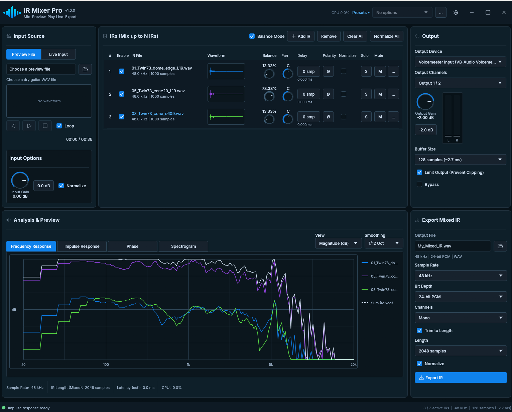

<div align="center">
  
  <h1>IR Mixer Pro</h1>
  <p><strong>Build your cabinet sound from multiple impulse responses.</strong></p>
  <p>Load, blend, monitor, analyze, and export guitar cabinet IRs in one native Rust audio tool.</p>
  <p>
    <a href="https://github.com/HugoSart/ir-mixer-pro/actions/workflows/ci.yml"></a>
    <a href="https://github.com/HugoSart/ir-mixer-pro/releases"></a>
    <a href="LICENSE"></a>
    
    
  </p>
  <p>
    <a href="https://github.com/HugoSart/ir-mixer-pro/releases"><strong>Releases</strong></a>
    ·
    <a href="docs/product-spec.md"><strong>Product specification</strong></a>
    ·
    <a href="docs/development.md"><strong>Development guide</strong></a>
  </p>
</div>



IR Mixer Pro shares one application model, DSP engine, and custom egui interface
across its product targets. The Windows standalone host is the current executable
implementation, with preview-file playback, live audio input, partitioned
convolution, multi-IR mixing, analysis, presets, and mixed-IR WAV export.

> **Project status:** the Windows standalone application is implemented. VST3 and
> CLAP adapters remain on the first-release roadmap and are not included in current
> builds.

## Quick start

Install the current stable Rust MSVC toolchain and the Windows SDK, then run the
native standalone application:

```powershell
cargo run --release
```

Release mode is strongly recommended for audio testing. Debug builds may not
process small device buffers quickly enough and can sound glitchy even when the
DSP behavior is otherwise correct.

Run the deterministic mock backend without opening audio devices or files:

```powershell
$env:IR_MIXER_MOCK = "1"
cargo run
```

Run the component gallery:

```powershell
cargo run -p ir-ui-gallery
```

IR Mixer Pro does not redistribute third-party audio fixtures. Use WAV files you
own or are licensed to use when trying preview playback and IR loading.

See the [development guide](docs/development.md) for complete toolchain setup,
checks, snapshots, and common diagnostics.

## Documentation

- [Product specification](docs/product-spec.md) — normative multi-format product requirements
- [Architecture](docs/architecture.md) — current workspace, data flow, threading, and extension points
- [Audio processing](docs/audio-processing.md) — sample rates, IR preparation, monitoring, and export fidelity
- [Development](docs/development.md) — running, testing, visual regression, and troubleshooting
- [Build and release](docs/build-and-release.md) — CI, packaging, signing, and release gates
- [Roadmap](docs/roadmap.md) — remaining first-release and post-release work
- [UI design](design/ui-design.md) — implemented application layout and interaction contract
- [UI design system](design/ui-design-system.md) — visual tokens and reusable component rules

## Repository layout

```text
src/                 Native standalone launcher
crates/ir-app/       Serializable state, commands, backend contract, and mock backend
crates/ir-core/      WAV I/O, audio buffers, resampling, analysis, and offline export
crates/ir-dsp/       Partitioned convolution and real-time mix engine
crates/ir-native/    CPAL host, workers, dialogs, presets, and native backend
crates/ir-ui/        Theme, widgets, cards, application page, and visual tests
tools/ui-gallery/    Interactive component and card gallery
tools/               Release packaging scripts
docs/                Product, engineering, and release documentation
design/              Current UI contract, visual tokens, artwork, and historical mockups
```

## Product targets

- Windows standalone application
- VST3 plugin
- CLAP plugin

The standalone application owns device routing. Plugin builds will receive audio
configuration from the host and reuse the shared state, DSP, UI, preset,
analysis, and export layers.

## Contributing

Pull requests target `main` and must pass formatting, strict Clippy, tests, and
the locked release build. Use [Conventional Commits](https://www.conventionalcommits.org/)
for commit messages so release-please can build the changelog and select the next
semantic version. Start user-visible fixes with `fix:` and features with `feat:`.

## License

IR Mixer Pro is free software licensed under
[GPL-3.0-or-later](LICENSE).
