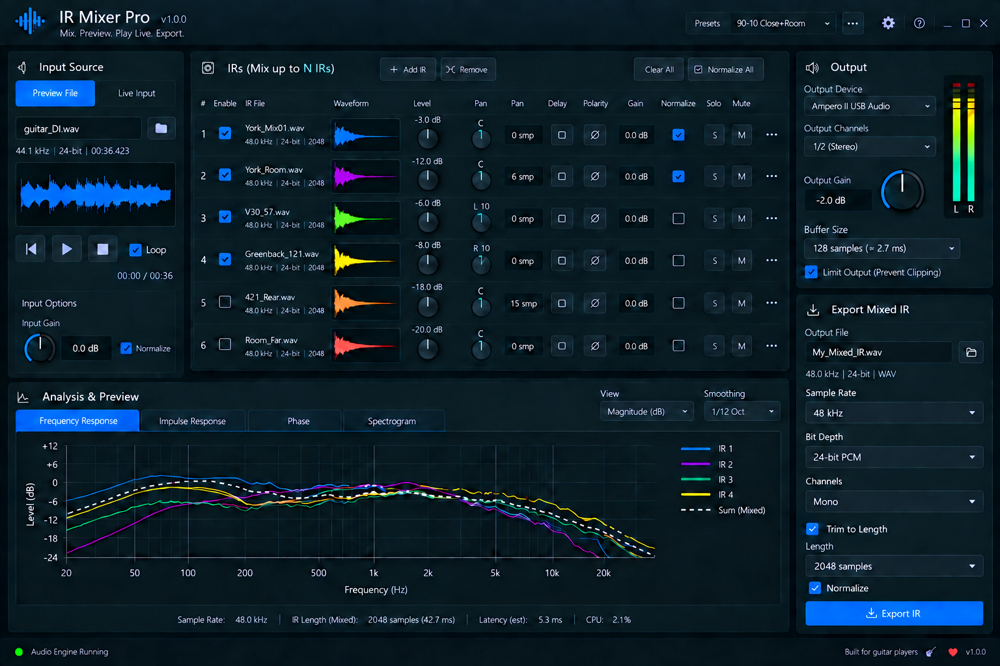

# IR Mixer Pro

IR Mixer Pro is a Rust desktop application and audio plugin for loading,
blending, previewing, analyzing, and exporting guitar cabinet impulse responses.

The native standalone backend, shared partitioned-convolution engine, WAV
loading, preview playback, analysis, presets, and mixed-IR export are
implemented. The reusable mock backend remains available for UI development.
VST3 and CLAP adapters are the next product milestone.



## Run the native application

```powershell
cargo run
```

Audio streams open when live monitoring or preview playback starts. IR loading,
resampling, FFT preparation, analysis, preset I/O, and export run outside the
audio callback.

## Run with the mock backend

```powershell
$env:IR_MIXER_MOCK = "1"
cargo run
```

The mock backend exercises the interface without opening files or devices.

## Run the component gallery

Install the current stable Rust toolchain, open a terminal in the repository
root, and run:

```powershell
cargo run -p ir-ui-gallery
```

The gallery is the executable reference for colors, typography, buttons,
checkboxes, dropdown and list selectors, toggles, value controls, waveforms,
meters, graphs, and component states. Its icon-only actions include both
outlined and borderless variants.

The **Cards** tab shows Input Source (Preview and Live), a scrollable multi-IR
rack, Analysis & Preview, Output, and Export Mixed IR cards. Controls update
dummy gallery state; Browse cycles example filenames and Play advances a
simulated clock. The Output meter is animated; device, file, and export actions
are only simulated—no audio devices or files are opened.

## Development checks

Run the full workspace test suite:

```powershell
cargo test --workspace
```

Run formatting and lint checks:

```powershell
cargo fmt --all -- --check
cargo clippy --workspace --all-targets -- -D warnings
```

Visual regression baselines live in `crates/ir-ui/tests/snapshots`. Update them
only after reviewing the rendered changes:

```powershell
$env:UPDATE_SNAPSHOTS = "force"
cargo test -p ir-ui
```

## Repository layout

```text
crates/ir-app/      Serializable application state, commands, and mock backend
crates/ir-core/     WAV handling, resampling, offline transforms, and analysis
crates/ir-dsp/      Partitioned convolution and real-time mix engine
crates/ir-native/   CPAL host, workers, persistence, and native backend
crates/ir-ui/       Reusable theme, widgets, cards, and complete application page
tools/ui-gallery/   Native Storybook-style component gallery
docs/               Product, architecture, and UI specifications
src/main.rs         Native standalone application launcher
```

Start with these documents:

- [Product specification](docs/PRODUCT_SPEC.md)
- [Architecture](docs/ARCHITECTURE.md)
- [UI design](docs/UI_DESIGN.md)
- [UI design system](docs/UI_DESIGN_SYSTEM.md)

## Planned product targets

- Standalone desktop application
- VST3 plugin
- CLAP plugin

All targets share the same application model, DSP engine, and UI component
library where host constraints allow it.
